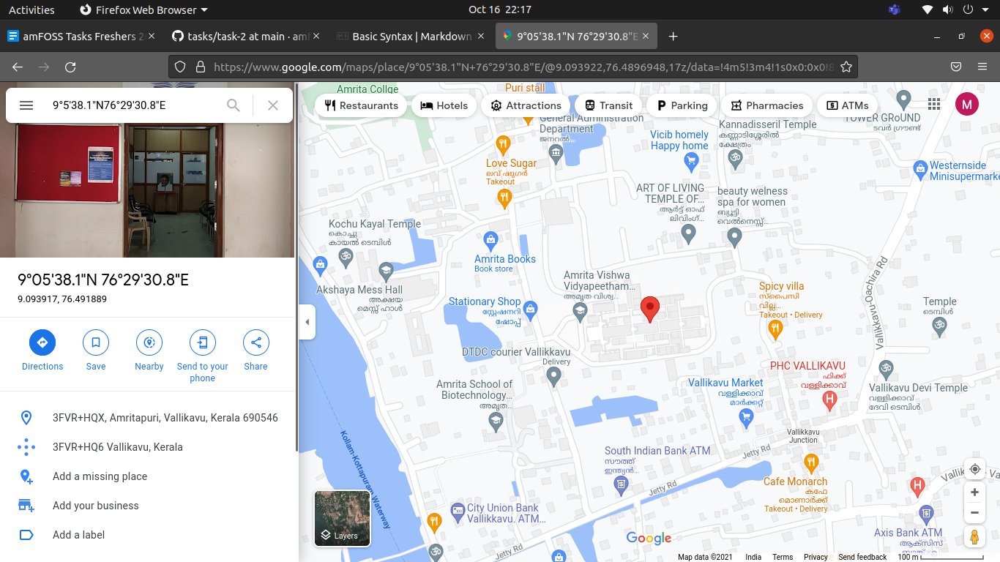

# Terminal Commands Used
Used **mkdir** to make the Coordinates-Location,North and East directories.

To navigate through the directories and see the files in the current directory i used **cd** and **ls**

To create and write the value into NDegree.txt,NMinute.txt,NSecond.txt and EDegree.txt,EMinute.txt,ESecond.txt i used **echo** command.
echo "value" > filename.txt

To combine the N*.txt and E*txt to NorthCoordinate.txt and EastCoordinate.txt i used **cat** command.
cat N*.txt > NorthCoordinate.txt

Used **cp** and **mv** commands to copy NorthCoordinate.txt and EastCoordinate.txt to Coordinate-Location and rename it to North.txt and East.txt respectively.
cp North/NorthCoordinate.txt
mv NorthCoordinate.txt North.txt

Used **rm** to delete NorthCoordinate.txt and EastCoordinate.txt from the other directories
rm NorthCoordinate

Again used **cat** to combine North.txt and East.txt to Location-Coordinate.txt

# Screenshot

# Git Commands to use

git init
git add
git commit
git push

